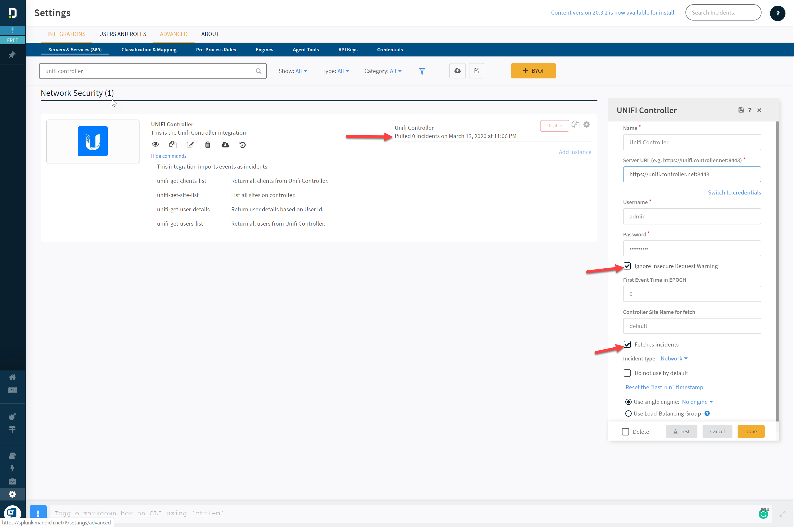

# Unifi-Demisto
Demisto integration for Unifi Controller. Integration allows you to pull in controller IPS alerts into Demisto. 

## Available Commands
| Name                   | Description                               |
|------------------------|-------------------------------------------|
| unifi-get-user-details | Return user details based on User Id.     |
| unifi-get-site-list    | List all sites on controller.             |
| unifi-get-users-list   | Return all users from Unifi Controller.   |
| unifi-get-clients-list | Return all clients from Unifi Controller. |

## Installation
1. Navigate to (Settings > Integrations > Select: Upload Integration)
2. Upload: unifi_unified.yml
3. Select: Save

## Setup
1. Navigate to (Settings > Integrations > Search: UNIFI Controller)
2. Select: Add instance
3. Provide the following settings
    - Name: (ex: UNIFI Controller Site Default)
    - Server URL: (ex: https://unifi.controller.net:8443)
    - Username: (ex: demisto)
    - Password: (ex: D3m1st0S3cr3t)
    - [ x ] Ignore Insure Request Warning
    - First Event Time: 0
    - Site Name: default
    - [ x ] Fetches incidents (IMPORTANT: Required to pull alerts as Incidents)
 4. Select: Test, If fails validate Server URL, Username and Password. 
 5. Select: Done
 6. Test playground commands
## Screenshots 
### Setup

### unifi-get-site-list

### unifi-get-user-details

### unifi-get-users-list

### unifi-get-clients-list

